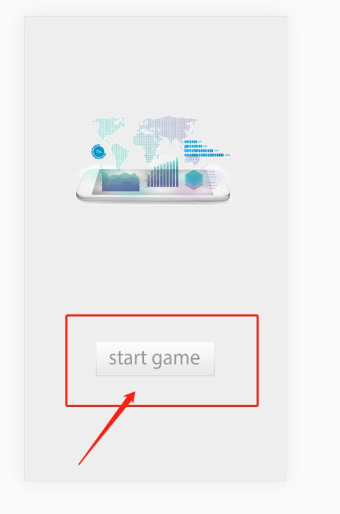

啊，国庆放假没有缓过来今天继续我们的教程。
我们上一章说到创建了舞台，现在要往舞台上添加东西来，我们今天做游戏的开始画面。
在js目录下新建一个readyScene.js脚本文件，这个是我们的游戏准备场景。
;
先看一下我们的代码
；
我们创建了一个新的类命名为readyScene,并通过Extends参数继承自 Hilo.Container,不知道Container的可以看我们的第一章。

es6通过super关键字访问父对象上的函数，所以Hilo也提供了一个类似的：readyScene.superclass.constructor.call(this, properties);
superclass就是Hilo给我提供的，将this和properties参数也带过去给父对象，这样父对象也可以访问到我们这个类中了。
在页面中引入这个文件;
在game.js中实例化，在game.js中新建一个initScenes函数
然后在initStage中执行;
在initScenes中实例化我们的ready场景;
传入一个对象，对象参数的ID就是我们给这个场景命名的id，剩下的4个参数是我们定义的参数，之后我们可以在readyScene中接收到。
我们可以看到我们的参数中时这么写的btn: this.asset.btnList2
 this.asset.btnList2指的是我们之前在资源下载文件中下载的文件名字为btnList2，看我们的第二章。
 之后分别传入宽高，我们在另一个文件用到，当然可以不传宽高，去readyScene里再写一遍，我这里是之前传过去用了，宽高怎么来可以看我们上一章。
 还有一个关键方法，添加到舞台.addTo(this.stage);将这个场景添加到舞台中去，这样才会出现画面。
 ;
 回到我们的readyScene.js文件，我们在init方法里添加我们的场景图像，首先我们先制作一个背景，;
 properties中包含了我们在game.js中传过来的参数，我们直接使用。
 new Hilo.View()是实例化一个可视容器，我们拿这个来当背景，设置背景颜色background:'#eeeeee'和id:'bg';
 id可以更方便我们在其他地方访问它。关键方法.addTo(this);添加到当前容器，container，我们继承的是container，类似与普通网页开发的div，可以这么理解。
 然后再添加一个logo标题；；
 看一下代码；
 我们实例化了一个Bitmap对象，不知道Bitmap的看我们第一章，用这个来绘制我们的logo。
 image:prop.logoImg; image参数是固定的，传入一张图片，设置图片左右居中也就是x轴居中 x:this.width/2-prop.logoImg.width/2*.5。
 scaleX:.5,
 scaleY:.5
 缩放0.5倍，所以我们x轴居中的室友也要乘以0.5；最后添加到当前。
 logo有了，现在还有需要一个开始按钮，；
 看一下代码；
 实例化一个Button;Button主要有四个参数，我们用三个
  upState: 按钮弹起状态的属性或其drawable的属性的集合。
  overState: 按钮经过状态的属性或其drawable的属性的集合。
  downState: 按钮按下状态的属性或其drawable的属性的集合。
  disabledState: 按钮不可用状态的属性或其drawable的属性的集合。
我们用到的三个
upState: {rect:[580, 785, 370, 100]},
overState: {rect:[580, 920, 370, 100]},
downState: {rect:[586, 920, 362, 100]},
传入一个对象，参数rect，因为我们的图片是雪碧图，所以我们要裁剪它，rect是一个数组，数组中第一和第一个分别是x和y，第三和第四个是宽和高。这里指的是图片集合中按钮的属性，和下图中的宽高不一样
；
单独设置的宽高是这对这整个按钮设置的。
最后添加到当前。
只有一个静态场景太单调了，我们最后再给logo做点动态效果，看代码。
；
我们使用了Tween缓动方法，这个是Hilo提供的动画工具，看我们第一章介绍，
Hilo.Tween.to(this.logos,{
			    y:190
			},{
			    loop:true,
			    reverse:true
			})
to方法是从太状态变换到我们设置的状态，我们传了三个参数，第一个参数this.logos就是我们要添加缓动对象，也就是我们的logo，第二个是变换的参数，我吗设置y轴为190，到时候logo就在190和他原来的位置进行缓动，第三个参数是动画参数，有很多，东家需要去看一下文档loop是一直循环，reverse是往复运动。
最后看一下我们的成果;
这样我们学会场景制作，以后的制作就简单了，场景制作学会后就是写逻辑了，左慈教程较短，下一章就制作主场景。
最后放源码链接：

 