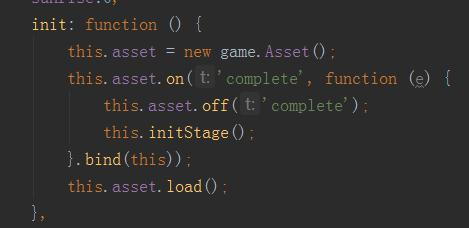
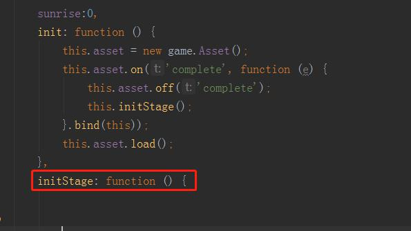
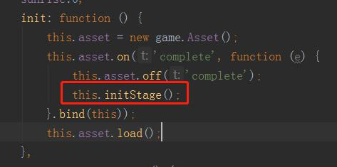
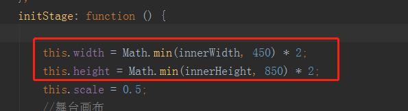
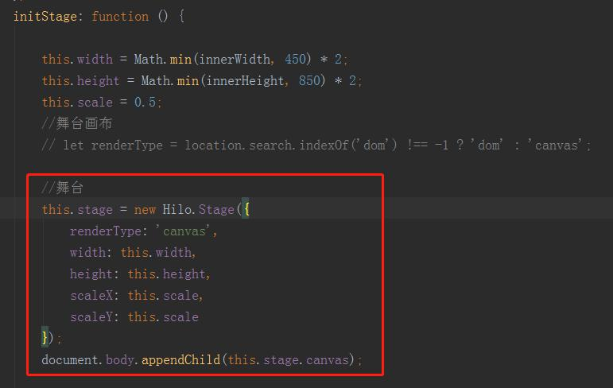
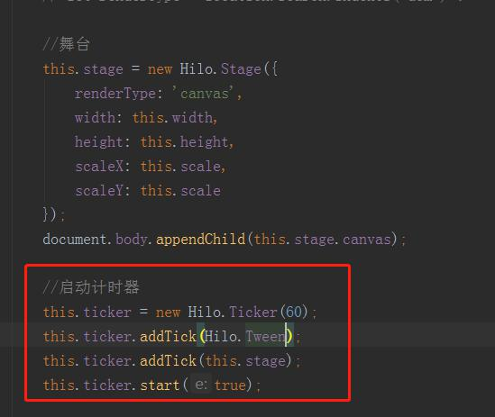
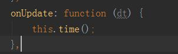
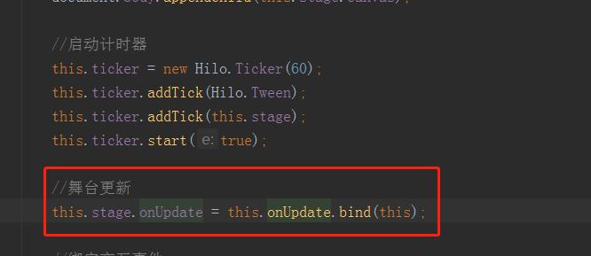
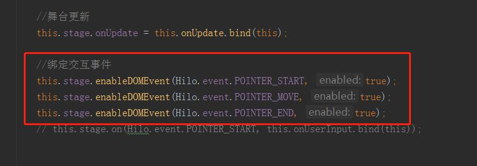
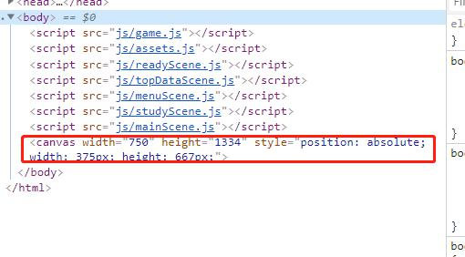

今天我们要用我们尚一章下载下来的资源搭建我们的第一个场景，游戏的准备页面。

现在，我们要创建我们游戏的舞台，用来显示各种场景。
打开我们在上一章创建的game.js文件，在init方法中添加如下代码

实例化我们的资源加载Asset类，赋值this.asset,方便我们在其他地方访问。
添加监听事件，当资源下载完成之后执行游戏初始化。
我们在assets文件中已经把事件监听发送出来了，所以我们在实例化之后写上
this.asset.on('complete', function (e) {
     this.asset.off('complete');//成功后关闭监听
}.bind(this));
this.asset.load();//启动下载资源

再写一个initStage的方法.
这个是用来初始化我们的舞台的，在文件下载完成之后，再执行这个方法;

接下来在这个方法中初始化我们的舞台宽高;分别赋值this.width和this.height;方便我们在其他地方也可以用到。
讲一下Math.min(innerWidth, 450) * 2;这行代码的意思，Math.min()去两个参数中最低的一个，当屏幕小于第二个参数时就取第一个，乘以2倍，再缩小0.5倍，我们写的this.scale = 0.5;就是缩0.5倍，这样可以适配大部分的手机屏幕，当然ipad这样的要用其他写法。
我们在初始化舞台的时候回用到这些参数，;
实例化舞台类new Hilo.Stage();参数renderType是我们要已什么方式渲染舞台，可以是webgl，canvas，dom，我们这里用canvas就可以了，如果是动作类游戏或者拥有大量动画元素的游戏可以使用webgl的方式渲染。
下面的参数分别就是我们之前写放上去就可以，scaleX， scaleY分别是舞台的x轴缩放倍数和y轴的。
最后添加舞台到页面中document.body.appendChild(this.stage.canvas);这时候我们如果往舞台添加东西是没有效果的，还要让我太实时更新，和我平时用的setInterval();差不多，这里hilo封装了requestAnimationFrame()和setInterval();我们不用去选择。
;启动定时器，实例化定时器new Hilo.Ticker(60);参数中的60的意思是我们要以60帧每秒去渲染页面，赋值到this.ticker;
在定时器列队添加一个缓动方法this.ticker.addTick(Hilo.Tween);Hilo.Tween方法是hilo引擎提供的一个简单缓动动画方法，我们需要做一下缓动的动画，所以我们也把它添加的定时列队中去。
然后添加舞台到列队中this.ticker.addTick(this.stage);this.stage就是我们赋值的舞台。
最后启动定时器this.ticker.start(true);
这时候我们的舞台就是不断的更新，我们新建一个onUpdate方法来接收我们的舞台更新记录
舞台每次更新都会触发一个我们的这个方法，我们之后的时间系统就用得到了，日出日落的效果。

然后开启舞台的触摸事件，hilo默认是关闭舞台的触摸事件，我们要把它打开，不然我点击屏幕就没有任何反应了。
;
舞台事件有三个Hilo.event.POINTER_START触摸开始事件，对应鼠标按下事件。
Hilo.event.POINTER_MOVE触摸移动事件，对应鼠标移动事件。
Hilo.event.POINTER_END触摸结束事件，对应鼠标弹起事件。
开打浏览器按F12，点击调式工具的Elements就可以看到我们的舞台了;
今天教程就这些把，太长大家就不会认真去看了，我平时也一样，如果一篇教程老长老长的我就没有心思认真完整的去看完了。
最后还是附上链接:

